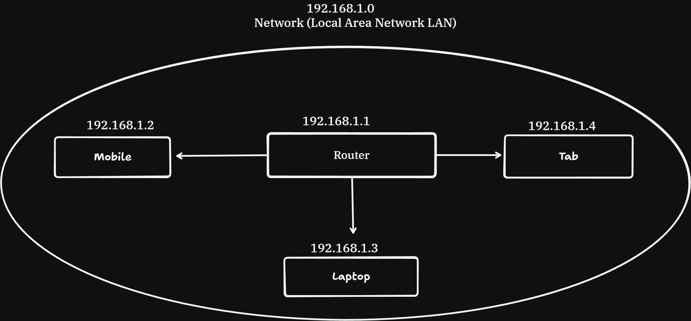

# COMPUTER NETWORKS

It is a group or system of interconnected peoples or items.
Computers connected with each other with cables or wireless is called **computer networks**
**Internet** : It is a network of computer networks. Complex web of interconnected computer networks.

## 1. Terminologies
- **Network Protocols**: It is a set of rules and regulations setup to communicate and share information over a network.
	- e.g.  HTTP, UDP, TCP, SMTP, etc
- **Packets**: In order to share data, we can send big chunk of data over the network. So, we divide the data into small chunks, these small chunks are called packets. 
- **Address**: Sending a message over the networks requires the destination details. This details uniquely identify the end system is called address.
- **Ports**: Any machine could be running many networks applications. In order to distinguish these apps for receiving messages, we use ports(port number).
	> IP-address + port = socket
	- Range : 0-2^16 = 65535
	- **0-1023** is called **known ports**.
	- port 80 belongs to **http** and port 443 to **https**
	- **1024-49152** is called **registered ports**. Any third-party can use these ports.
		- e.g. SQL Server uses 1433, MongoDB uses 27017
	- **49152-65535** is called dynamic ports. These are for future purpose.
- **Access Networks**: These are media using which end systems connect to the internet.
- **DSL (Digital Subscriber Line)**: It uses the existing telephone groundwork lines for internet connection. Generally, DSL is provided by the same company which supplies telephone service. 
	- ISP (Internet Service Provider)
	- Cable Network
	- Fiber Network
	- Satellite Network

## 2. IP Address Structure
IP (Internet Protocol) Address is a unique logical address assigned to every device connected to a network. It allows devices to communicate with each other by identifying the source and destination of data packets.

**e.x :** Laptop A (192.168.1.10) --> Router --> Internet --> Server(142.250.183.78)

### TYPES:-
1. **IPv4**
	- 32-bit address (8+8+8+8 = 32 bits/4 bytes)
	- Written in decimal (192.168.1.25)
	- consist of 4 octets (each octet contain 8 bits)

e.x - 192.168.1.25 (Each octet ranges from 0-255)

- Decimal : 192.168.1.25
- Binary : 11000000 10101000 00000001 00011001

2. **IPv6**
	- 128-bit address
	- written in hexadecimal

e.x - 2001:0db8:85a3:0000:0000:8a2e:0370:7334


We have a IP which is reserved for the whole network **(192.168.1.0)**.
When we connect phone to router with the help of DHCP router assign some unique IP to the phone (192.168.0.1) and so on.


**CIDR (Classless Inter-Domain Routing)/ CIDR notation** is a method of allocating IP addresses and routing IP packets more efficiently than the older **classful addressing** system (Class A, B, and C).

**Example:-** 192.168.1.0/x - where x - is integer between 0-32 bits which tell how much bit is reserved for my network.
lets assume x = 24, so
192.168.1.0/24 : so the first 3 octet (or first 24 bits ) are reserved for my network. if we connect one more host to our router then the first 3 octet i.e: 192.168.1 will be same and the last octet is reserved for the host which will be unique.
>for CIDR notation 192.168.1.0/24 : The network can only host (32-24=8) 2^8 machine i.e 256 hosts can be connected in router.

> For CIDR notation 192.168.0.0/16 : The network can host (32-16=16) 2^16 machine i.e 65000 hosts can be connected.

### How devices communite in local network.

A **subnet mask** is a **32-bit number** used to identify whether an IP address is within the same network, in order to determine if devices can communicate directly.

Without a subnet mask, a device cannot determine whether another IP address is on the same local network or on a different network

### How Does a Subnet Mask Work?

 We want to send data from Laptop(192.168.1.4) to mobile(192.168.1.2) within the local network.
 ```
Laptop IP: 192.168.1.4
Subnet Mask: 255.255.255.0
Mobile IP: 192.168.1.2
```
So, it will check the destination IP is within the local network or not. so first we will apply subnet mask on our own IP(laptop) then will apply for the mobile IP.
```
11000000.10101000.00000001.00000100 -- laptop ip
11111111.11111111.11111111.00000000 -- subnet IP
----------------------------------- -- & operation
11000000.10101000.00000001.00000000 -- which is my network IP 192.168.1.0 


11000000.10101000.00000001.00000010 -- Mobile IP
11111111.11111111.11111111.00000000 -- subnet IP
----------------------------------- -- & operation
11000000.10101000.00000001.00000000 -- which is my network IP 192.168.1.0 
```
So, with the above operations we see that both IPs match, which means the mobile and laptop are on the same network. This means the laptop can send data directly to the mobile without going through the router.

**What if Mobile is not connected to local Network.**

Here the laptop knows the mobile IP but it doesn't know that weather it is in same network or not so we use subnet mask to check it.
```
Laptop IP: 192.168.1.4
Subnet Mask: 255.255.255.0
Mobile IP: 10.0.0.1 
```

```
11000000.10101000.00000001.00000100 -- laptop ip
11111111.11111111.11111111.00000000 -- subnet IP
----------------------------------- -- & operation
11000000.10101000.00000001.00000000 -- which is my network IP 192.168.1.0 

00001010.00000000.00000000.00000001 -- Phone ip
11111111.11111111.11111111.00000000 -- subnet IP
----------------------------------- -- & operation
00001010.00000000.00000000.00000000 -- which is differnet IP 10.0.0.0 
```
Since the mobile and laptop are not in the same network, in order to send data we have to send it through the router, and we need internet access for it.

### Common Subnet Masks

| Subnet Mask     | CIDR | Total Addresses | Usable Hosts |
|------------------|------|------------------|----------------|
| 255.0.0.0        | /8   | 16,777,216       | 16,777,214     |
| 255.255.0.0      | /16  | 65,536           | 65,534         |
| 255.255.255.0    | /24  | 256              | 254            |

**Example with /24 (255.255.255.0):**
-   Total addresses = 256 (from `192.168.1.0` to `192.168.1.255`)
-   Reserved: `192.168.1.0` (network) and `192.168.1.255` (broadcast)
-   Usable = 256 − 2 = **254** (`192.168.1.1` to `192.168.1.254`)

### How data is Send Outside the local network.

A **Default Gateway** is the device (usually a **router**) that a computer sends its data to when the destination IP is **not in the same network**

#### Example
```
Laptop IP:        192.168.1.10
Subnet Mask:      255.255.255.0
Default Gateway (Router):   192.168.1.1
```
-   If the laptop wants to reach `192.168.1.50` → same network → sent **directly**, no gateway involved.
-   If the laptop wants to reach `google.com` (some IP like `172.217.24.142`) → different network → sent to the **Default Gateway (192.168.1.1)**, which is the router, and the router forwards it to the internet.