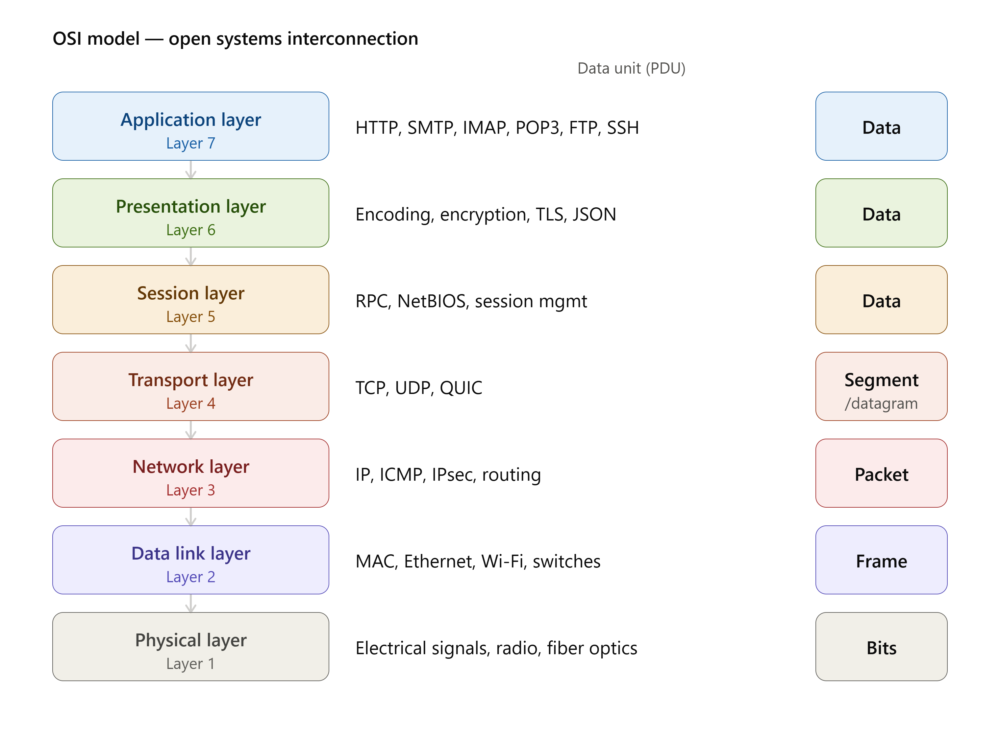
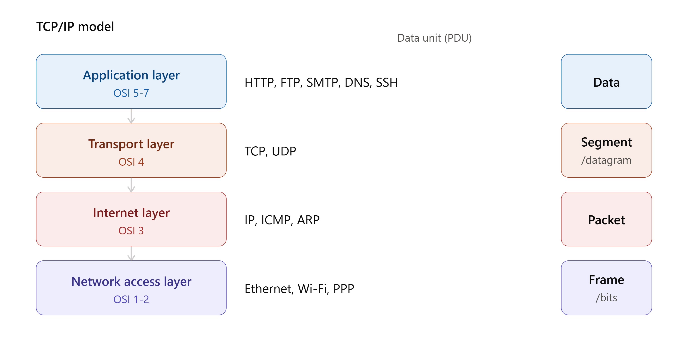

# COMPUTER NETWORKS
## INDEX
[1. Terminologies](#1-terminologies)

[2. IP, subnet, CDIR](#2-ip-address-structure)

[3. MAC, NIC, ARP](#3-mac-address-structure)

[4. OSI/TCP]()

It is a group or system of interconnected peoples or items.
Computers connected with each other with cables or wireless is called **computer networks**
**Internet** : It is a network of computer networks. Complex web of interconnected computer networks.

## 1. Terminologies
- **Network Protocols**: It is a set of rules and regulations setup to communicate and share information over a network.
	- e.g.  HTTP, UDP, TCP, SMTP, etc
- **Packets**: In order to share data, we can send big chunk of data over the network. So, we divide the data into small chunks, these small chunks are called packets. 
- **Address**: Sending a message over the networks requires the destination details. This details uniquely identify the end system is called address.
- **Ports**: Any machine could be running many networks applications. In order to distinguish these apps for receiving messages, we use ports(port number).
	> IP-address + port = socket
	- Range : 0-2^16 = 65535
	- **0-1023** is called **known ports**.
	- port 80 belongs to **http** and port 443 to **https**
	- **1024-49152** is called **registered ports**. Any third-party can use these ports.
		- e.g. SQL Server uses 1433, MongoDB uses 27017
	- **49152-65535** is called dynamic ports. These are for future purpose.
- **Access Networks**: These are media using which end systems connect to the internet.
- **DSL (Digital Subscriber Line)**: It uses the existing telephone groundwork lines for internet connection. Generally, DSL is provided by the same company which supplies telephone service. 
	- ISP (Internet Service Provider)
	- Cable Network
	- Fiber Network
	- Satellite Network

## 2. IP Address Structure
IP (Internet Protocol) Address is a unique logical address assigned to every device connected to a network. It allows devices to communicate with each other by identifying the source and destination of data packets.

**e.x :** Laptop A (192.168.1.10) --> Router --> Internet --> Server(142.250.183.78)

### TYPES:-
1. **IPv4**
	- 32-bit address (8+8+8+8 = 32 bits/4 bytes)
	- Written in decimal (192.168.1.25)
	- consist of 4 octets (each octet contain 8 bits)

e.x - 192.168.1.25 (Each octet ranges from 0-255)

- Decimal : 192.168.1.25
- Binary : 11000000 10101000 00000001 00011001

2. **IPv6**
	- 128-bit address
	- written in hexadecimal

e.x - 2001:0db8:85a3:0000:0000:8a2e:0370:7334


We have a IP which is reserved for the whole network **(192.168.1.0)**.
When we connect phone to router with the help of DHCP router assign some unique IP to the phone (192.168.0.1) and so on.


**CIDR (Classless Inter-Domain Routing)/ CIDR notation** is a method of allocating IP addresses and routing IP packets more efficiently than the older **classful addressing** system (Class A, B, and C).

**Example:-** 192.168.1.0/x - where x - is integer between 0-32 bits which tell how much bit is reserved for my network.
lets assume x = 24, so
192.168.1.0/24 : so the first 3 octet (or first 24 bits ) are reserved for my network. if we connect one more host to our router then the first 3 octet i.e: 192.168.1 will be same and the last octet is reserved for the host which will be unique.
>for CIDR notation 192.168.1.0/24 : The network can only host (32-24=8) 2^8 machine i.e 256 hosts can be connected in router.

> For CIDR notation 192.168.0.0/16 : The network can host (32-16=16) 2^16 machine i.e 65000 hosts can be connected.

### How devices communite in local network.

A **subnet mask** is a **32-bit number** used to identify whether an IP address is within the same network, in order to determine if devices can communicate directly.

Without a subnet mask, a device cannot determine whether another IP address is on the same local network or on a different network

### How Does a Subnet Mask Work?

 We want to send data from Laptop(192.168.1.4) to mobile(192.168.1.2) within the local network.
 ```
Laptop IP: 192.168.1.4
Subnet Mask: 255.255.255.0
Mobile IP: 192.168.1.2
```
So, it will check the destination IP is within the local network or not. so first we will apply subnet mask on our own IP(laptop) then will apply for the mobile IP.
```
11000000.10101000.00000001.00000100 -- laptop ip
11111111.11111111.11111111.00000000 -- subnet IP
----------------------------------- -- & operation
11000000.10101000.00000001.00000000 -- which is my network IP 192.168.1.0 


11000000.10101000.00000001.00000010 -- Mobile IP
11111111.11111111.11111111.00000000 -- subnet IP
----------------------------------- -- & operation
11000000.10101000.00000001.00000000 -- which is my network IP 192.168.1.0 
```
So, with the above operations we see that both IPs match, which means the mobile and laptop are on the same network. This means the laptop can send data directly to the mobile without going through the router.

**What if Mobile is not connected to local Network.**

Here the laptop knows the mobile IP but it doesn't know that weather it is in same network or not so we use subnet mask to check it.
```
Laptop IP: 192.168.1.4
Subnet Mask: 255.255.255.0
Mobile IP: 10.0.0.1 
```

```
11000000.10101000.00000001.00000100 -- laptop ip
11111111.11111111.11111111.00000000 -- subnet IP
----------------------------------- -- & operation
11000000.10101000.00000001.00000000 -- which is my network IP 192.168.1.0 

00001010.00000000.00000000.00000001 -- Phone ip
11111111.11111111.11111111.00000000 -- subnet IP
----------------------------------- -- & operation
00001010.00000000.00000000.00000000 -- which is differnet IP 10.0.0.0 
```
Since the mobile and laptop are not in the same network, in order to send data we have to send it through the router, and we need internet access for it.

### Common Subnet Masks

| Subnet Mask     | CIDR | Total Addresses | Usable Hosts |
|------------------|------|------------------|----------------|
| 255.0.0.0        | /8   | 16,777,216       | 16,777,214     |
| 255.255.0.0      | /16  | 65,536           | 65,534         |
| 255.255.255.0    | /24  | 256              | 254            |

**Example with /24 (255.255.255.0):**
-   Total addresses = 256 (from `192.168.1.0` to `192.168.1.255`)
-   Reserved: `192.168.1.0` (network) and `192.168.1.255` (broadcast)
-   Usable = 256 − 2 = **254** (`192.168.1.1` to `192.168.1.254`)

### How data is Send Outside the local network.

A **Default Gateway** is the device (usually a **router**) that a computer sends its data to when the destination IP is **not in the same network**

#### Example
```
Laptop IP:        192.168.1.10
Subnet Mask:      255.255.255.0
Default Gateway (Router):   192.168.1.1
```
-   If the laptop wants to reach `192.168.1.50` → same network → sent **directly**, no gateway involved.
-   If the laptop wants to reach `google.com` (some IP like `172.217.24.142`) → different network → sent to the **Default Gateway (192.168.1.1)**, which is the router, and the router forwards it to the internet.


##  3. MAC Address Structure
A **MAC (Media Access Control) Address** is a **unique 48-bit (6-byte) physical address** assigned to a **Network Interface Card (NIC)** by the manufacturer used to uniquely identify devices.

It is used for **communication within a Local Area Network (LAN)** and operates at the **Data Link Layer (Layer 2)** of the OSI model.

### MAC Address Structure
A MAC address is:

-   **48 bits**
-   **6 bytes**
-   Written as **12 hexadecimal digits**
-   Each pair represents **1 byte (8 bits)**
```
00:1A:2B:3C:4D:5E
or
00-1A-2B-3C-4D-5E
- 00:1A:2B : first 3bytes/1st 24bits are called OUI(Organizationally Unique Identifier) identifies the manufacturer (vendor), assigned by the IEEE.
- 3C:4D:5E : last 3bytes is unique for device Identifier (NIC Specific).
```
>NOTE
>```
>0-9 : decimals
>0-1 : binary
>0-16 : hexadecimal (0 1 2 3 4 5 6 7 8 9 0 A B C D E F)
>```


### Finding MAC Address
```bash
# Windows
ipconfig /all   
getmac
# Linux
ip link show
```
### NIC 
A **NIC (Network Interface Card)** is the **hardware component** that allows a computer to connect to a network.

Without a NIC, a computer cannot communicate over Ethernet or Wi-Fi.
#### Relationship Between NIC, Ethernet, Wi-Fi, Bluetooth, and MAC Address
                  Computer

      +---------------------------+
      |                           |
      |        Motherboard        |
      |                           |
      |  +---------------------+  |
      |  |   Network Interface |  |
      |  |      Card (NIC)     |  |
      |  +---------------------+  |
      |      │       │       │
      |      │       │       │
      | Ethernet   Wi-Fi   Bluetooth
      |      │       │       │
      |   MAC A   MAC B   MAC C
      +---------------------------+

|MAC| IP |
|--|--|
| Physical address (cannot change) | Logical address (can changed)|
|Layer 2 (Data Link)|Layer 2 (Data Link)|
|Usually assigned by manufacturer|Assigned manually or by DHCP|
|48 bits|IPv4 = 32 bits, IPv6 = 128 bits|

### ARP
**ARP (Address Resolution Protocol)** is used in **IPv4** networks to find the **MAC address corresponding to an IP address on the same local network**.


It takes IP as an input and return the MAC for the device holding that IP.

### ARP cache
```bash
# It displays the ARP cache/table — a list of IP addresses mapped to their corresponding MAC addresses for devices your computer has recently communicated with on the local network.
# Windows
nrp -a   
# Linux
nrp -n
```

```
User Types www.google.com
            │
            ▼
DNS → Get Google's IP
            │
            ▼
Destination is outside LAN
            │
            ▼
Need Router's MAC
            │
            ▼
ARP Request (Broadcast)
            │
            ▼
Router Sends ARP Reply
            │
            ▼
ARP Cache Updated
            │
            ▼
Create IP Packet
(Source IP → Destination IP)
            │
            ▼
Encapsulate in Ethernet Frame
(Source MAC → Router MAC)
            │
            ▼
Router Forwards Packet
            │
            ▼
Each Router Replaces Layer 2 MAC Addresses
            │
            ▼
Packet Reaches Google Server
```

## OSI MODEL
Open Systems Interconnection is a 7-leyer networking model that explains how data travels from one device to another over a network.



```
1. Suppose you open Chrome and visit:
	https://google.com
when we click on Search Then....
```
**7. APPLICATION LAYER:** Provide services directly to the user. It is the interface between the application and the network.
- Example: Chrome, Firefox, Whatsapp, Outlook
- Protocol: HTTP, SMTP, IMAP, POP3, FTP, SSH
```
2. Chrome sends think og i want to open google 
	GET /HTTP/1.1
	Host: google.com
```
**6. PRESENTATION LAYER:** makes data readable for both sender and receiver.
- It handles encryption, decryption, compression, encoding.
- In nodeJS we use openssl for enycryption and zlib for compression.
```
3. 
https://  -- TLS/SSL encrypts the request.
Encryption: password = 12345 ---> J8af#$#@%F (encrypted only google can decrypt it)
compression : 10MG image --> 2MB image
Encoding: converts "English Hindi" --> YTF-8 bytes
Without this layer receiver wouldn't understand the format.
```
**5. SESSION LAYER:** creates and manages communication sessions.
- Responsibilities: start session, maintain session, close session.
```
4.
If you login into Gmail.
A session is created. if wifi disconnects for 2 seconds the session lyaer tries to resume communication.
```
**4. TRANSPORT LAYER:** reliable delivery. This is one of the most important layers.
- Protocols: TCP --> Segment, UDP --> Datagram
```
5. 
TCP: downloading a movie 2GB.
movie is divided into 
- packet 1
- packet 2
- packet 3
- packet 4
- ...
If packet 3 is lost. TCP requests please resend packet 3.

UDP : Fast used in video calling, gaming, etc. If one packet is lost video continues, no retransmission.
```
> NOTE: Transport Layer uses ports.
> ```
> HTTP : 80
> HTTPS : 443
> SSH : 22
> SQL Server : 1433
> MySQL : 2206
> DNS : 53
> PostgreSQL : 5432
> Example: 192.168.1.10:443  --> connect to https service.
>```


**3. NETWORK LAYER:** Provides logical addressing and routing. This layer decide the route.
- Responsibilities: IP address, Routing, Best path selection

```
6. 
laptop IP : 192.168.1.20
Google IP : 54.23.43.53
Router Checks : Destination IP --> ISP --> INternet --> Google
```

**2. DATA LINK LAYER:** communication inside the local network (LAN).
- Uses: MAC address, Frames, Error detection.
- Protocol: Ethernet, ppp, VLAN
```
Find router MAC using ARP.
```


**1. PHYSICAL LAYER:** it transmits bits.
- Deals with electrical signals, fiber optics, radio waves, cables.
- Example: Ethernet cable, wi-fi, Fiber, Bluetooth, USB
- Devices: Hub, Repeater, NIC, Fiber
```
electrical/light/radio signals converts into bits --> 1010101010 
```


## 4 TCP/IP MODEL


**1. Layer 4 – Application Layer** : Provides services directly to applications. This layer combine **Application** **Presentation ** and **Session ** layer.
- Protocols: HTTP, HTTPS, FTP, SMTP, DNS, SSH, Telnet, SNMP
```
When we type google.com
if HTTPS is used:-
- Encryption (TLS)
- Session Management
- Data Formating
are all handled here.
```
**2. Layer 3 – Transport Layer** : provide end-to-end communication.
- Protocol : TCP, UDP

**3. Layer 2 – Internet Layer**: moves packet between different networks.
- Protocol: IPv4, IPv6, ICMP, ARP

**4. Layer 1 – Network Layer**: handles communication on the local network and sends bits over the physical medium. This layer combine **Physical** and **Data Link** layer.