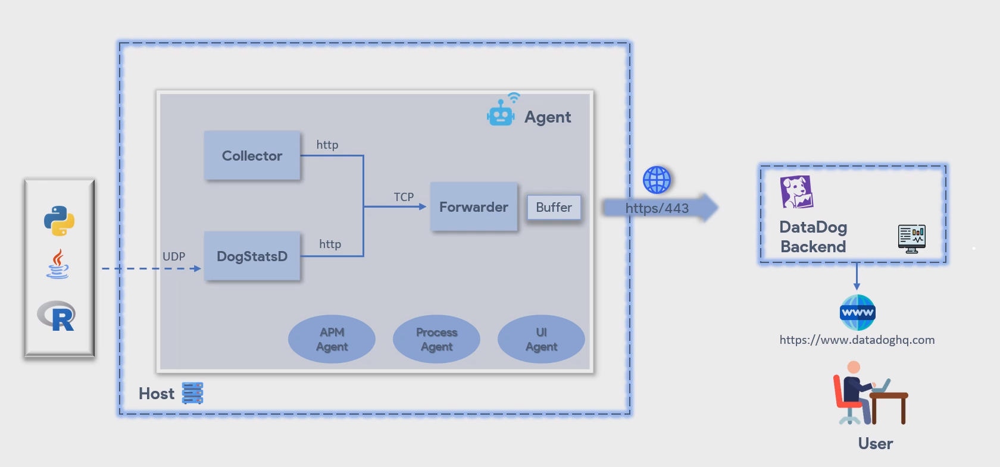

# Datadog

**Monitoring:** Continually watch the performance of an entity by evaluating the metrics collected from it. For example - website, software, infrastructure, servers, cloud services etc.
**What to Monitor:** website, network latency, uptime, throughput, success rate, error rate, CPU usage, etc.

**Datadog:** It is an observability service for cloud-scale applications, providing monitoring of servers, databases, tools, and services, through a SaaS-based data analytics platform.
**It covers wide range of monitoring:-**
- Infrastructure monitoring
- Database monitoring
- Cloud monitoring
- Log monitoring
- Application Performance monitoring
- Real User monitoring
- Container monitoring
- Security monitoring
- Synthetic monitoring
**Most Integrations:-**
- OS -> Windows, Linux, Mac
- Cloud -> AWS, Azure, GCP
- Containers -> Docker, Helm, Container-d
- Messaging Services -> Kafka, Apache active MQ, hive MQ
- Security -> Alcide, Apptrail, Okta, Hashicorp vault.

-> Was founded in year 2010 by Olivier Pomel
-> Datadog's agent code is open-sourced on Github.

### Monitoring tool Requirements:-
- Data collection
- Data storage
- Querying & Analysis
- Visualization and Alerting
- Scalability and Performance
- Integration & Extensibility 
- Security and Access Control

**Alternative: Prometheus, InfluxDb, Nagios, Sensu, Dynatrace, Graphite, New relic**

## Basic Terminologies
1. **HOST:** it is an entity which datadog has to monitor. example. servers, VMs, containers, IOT devices, Desktops, etc.
2. **Metric:** it is a time bound information pertaining to a system captured at a certain point in time.
**TYPES:-**
	- WORK METRICS: Indicate the top-level health of your system by measuring its useful output.
		- Throughtput
		- Success rate
		- Error rate
		- Performance
	- Resource Metrics: Indicate timely information of physical resource components such as CPU, memory, disks.
		- Utilization
		- Saturation
		- Availability
		- Errors
3. **Events:** It happens at infrequent occurrences that usually provides the details of a change that happened in the system.
4. **Agent:** It is a service that runs alongside the application software system/host to collect various events and metrics from it and sends it to the datadog backend via internet.

### Architecture

Host the client side and the datadog backend side. Host is a datadog agent which is a lightweight software which runs on host. 
Datadog agent is the core of data monitoring solution as it is responsible for collecting the events, matrics and logs from the host and sending them to data backend to which users interact and based on the requirements the metrics can be filtered, grouped and converted to dashboards.
So basically we can say agent as middle layer between the host and the data lock software, which is hosted on cloud.
Datadog agent is comprised of 2 component the **collector** and **forwarder**. Collector is in charge of running checks and collection metrics from the hosts. It gathers all the standard metrics every 15secs and the forwarder takes the payloads from the collector and sends it to datadog over HTTPS this is via internet using port **443**. And also to optimize the communication there is a **buffer ** attached to the forwarder.
When a certain limit in size or number of outstanding send requests are reached in the buffer, they are released to datadog backend.
Datadog agent can be a **dogStatsD** the service as well as it is optional. **DogstatsD** an implementation of statsD protocol is a metrics aggregation service bundled with the datadog agent to send custom metrics from your application to datadog backend.
**HOW DogstatsD works:** If we have python application or java or any other instrumented application then dogstatsD accepts custom metrics, events and service checks over UDP periodically aggregates them and ultimately forwards them to datadog. Now since it uses UDP your application can send metrics to datastatsDX and resume its work without waiting for a response.
NOW there are 3 more optional processes that can be spawned by the agent if enabled in the configuration file. 1st is the **IPM agent**, which is a process to collect traces, and the 2nd is **Process Agent** which is a process to collect live process information by default it only collects available containers otherwise it is disabled. 3rd is **UI Agent** this is the UI side of datadog agent. To see the details of datadog agent in UI, then there is option of its UI component which runs directly on the host where the datadog agent is running.
TO view the datadog agent's UI you have to configure the port on which the GUI should run in the datadog yml file. For windows and Mac the UI is already enabled by default and it runs on PORT 5002.

**Summary**: At first we install a datadog agent it can be integration service or dogstatsD on the host system. After installation, the collector part of it starts collecting data that is the metrics, events, logs or whatever from the host. And the forwarder components shifts the collector data to the cloud via memory buffer through circular HTTPS connections. Once the data reached the datadog backend users can access the datadog website and perform aggregations on that data or filter them trigger alerts to the users or create dashboards and less other activities can be performed using that data to generate meaningful insights.

Application Performance Management(APM):- The translation of IT metrics into business meaning. A practive to monitor application insights, so we can improve performance, improve user experience, reduce issues and errors.

You are my datadog Fundamentals exa,iner. Quiz me accross: ... . 30 questions. Don't reveal ansers untile  commit.