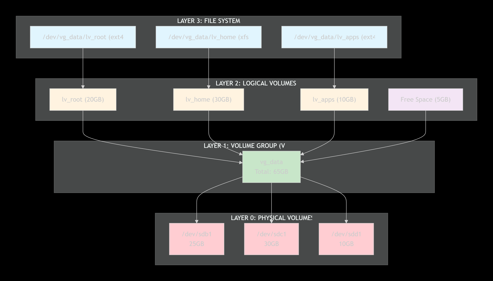
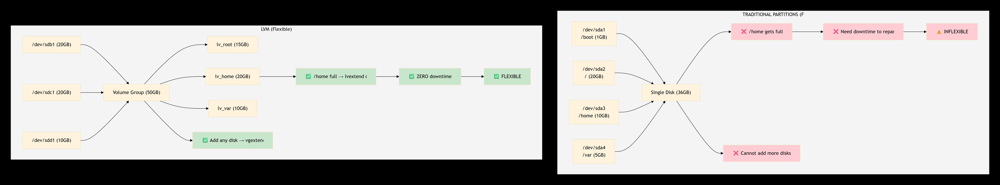

Content
1. [Linux](#linux)

# LINUX
Linux is a family of open-source Unix-like operating systems inspired by UNIX., based on the Linux kernel, a computer program that manages the system's hardware and software.

kernel that is used in a distribution, but most people just refer to it as an OS.
> 90% of application runs on **Linux**.

**Unix** is a proprietary (requiring a license for use), multitasking operating system, e.g. macOS, Debian. While **Linux** is a free and open-source, Unix-like operating system. e.g. Ubuntu, Kali Linux

### How to Use Linux
1.  **WSL (Windows Subsystem for Linux)** – Enable it on Windows to run Linux distributions natively.
2.  **Virtual Machine** – Use applications like [VirtualBox](https://www.virtualbox.org/wiki/Downloads)  to run Linux in a virtual environment.
3.  **Cloud Platforms** – Use Linux-based instances on AWS, GCP, or Azure.
4.  **Vagrant** – Try Linux environments locally using [Vagrant](https://developer.hashicorp.com/vagrant)

## Linux - OS
The kernel is the **heart**  of the operating system. It is written primarily in the **C programming language**  and acts as the bridge between the system hardware and software.
-   It manages system resources such as CPU, memory, and I/O devices.
-   Users interact with the kernel via a **shell** (command-line interface).    
-   Common shell commands include `mkdir`, `ls`, `cd`, etc.
- **root** is the most powerful account that can create, modify, delete accounts and make changes to system configuration files.
> **GRUB** (Grand Unified Bootloader) is the program responsible for loading and managing the boot process. It loads the **kernel**  of the OS into memory at startup.

Linux itself is not one single operating system. It has many versions called distributions (distros).

Examples:

- Ubuntu
- CentOS
- Debian
- Fedora
- Red Hat Enterprise Linux

Linux has hundreds of distributions (Linux OS versions). They are all based on the Linux kernel but are made for different purposes.

**Here are the most popular Linux OS families:**


**1. Debian Family** One of the oldest, free and most stable Linux families. e.x **ubuntu, kali linux, linux Mint**

**2. Red Hat Family** Popular in companies and enterprise servers. **Red Hat Enterprise Linux (RHEL), Fedora Linux, CentOS**

| |Debian| Red Hat | 
|--|--| -- |
| Package Management | apt + .deb packages | yum/dnf + .rpm packages |
|Where they are mostly used|Web servers, Cloud servers, Personal computers | Large companies, Banks, Government systems, Corporate servers |
|Cost Difference|Free|Paid|
|Package Commands|`apt`,`apt update`, `apt install`, `.deb`|`dnf/yum`, `dnf update`, `dnf install`, `.rpm`|
|Real-world example|A startup might use `AWS server -> Ubuntu -> Website`| A bank might use `Data Center -> RHEL -> Banking application`|


# 2. File System
OS stores files and directories in an organized and structured way. There are many different types of filesystems. 

Windows:-
- FAT32 : Pendrive (if files <4GB)
- NTFS : Windows system drive

Linux:-
- ext2
- ext3
- ext4 : General Linux desktop
- xfs : High-performance server / large files (RHEL/Fedora)
```bash
cd /
ls -l  # list all the files structure
/boot # contains file that is used by the boot loader (grub.cfg)
/root # root user home directory. It is not same as /
/dev # systems devices (e.x. disk, speakers, keyboards, etc)
/etc # all configuration files
/bin --> /usr/bin # everyday users commands
/opt # optional add-on applications (not part of OS apps)
/proc # running processes 
/tmp # directory for temporary files
/home # directory for user
/var # system logs
/run # system daemons that start very early to store temporary runtime file like PID files
/mnt # to mount external filesystem (e.x NFS)
```
# DISK MANAGEMENT AND RUN LEVELS
## System Run Level
**Main Run Level**
- 0 : Shutdown the system
- 1 : single-user mode, usually aliased as s or S
- 6 : Reboot the system

**Other Run Levels**
- 2 : Multiuser mode without networking
- 3 : Multiuser mode with networking
- 5 : Multiuser mode with networking and GUI.
```bash
# login as sudo
init 0  # same as shutdown now
init 6 # same as reboot
who -r # to check which runlevel you are currently
```

## 1. Modern Boot Process (UEFI + GPT)
> Older version uses BIOS + MBR boot sequence.
-   **Power On** – Electricity flows to the motherboard and CPU, same as before.
-   **UEFI (Unified Extensible Firmware Interface)** – The CPU starts executing firmware instructions, but this time from **UEFI**, which is stored in **flash memory** on the motherboard (not classic ROM). UEFI is more advanced than BIOS — it has its own mini operating system-like environment, can support a mouse-driven graphical interface, and can even access network/internet during boot.
-   **Settings Storage** – UEFI still uses a small battery-backed chip (successor to CMOS) to retain firmware settings and the system clock when the power is off.
-   **POST (Power-On Self-Test)** – UEFI still performs the same job as BIOS did: checking all connected hardware devices. If something fails, boot stops here.
-   **GPT (GUID Partition Table)** – Instead of reading an MBR, UEFI reads the **GPT**, a more modern partitioning scheme on the boot disk. GPT supports drives larger than 2TB and allows far more than the 4 primary partitions MBR was limited to.
-   **EFI System Partition (ESP)** – UEFI looks for a special partition called the **ESP**, formatted in FAT32, which contains the bootloader files (e.g., `bootmgfw.efi` for Windows, `grubx64.efi` for Linux).
-   **Bootloader → OS** – The bootloader in the ESP is executed, which then loads the OS kernel (Windows, Linux, etc.) into RAM, completing the boot process.

## 2. LVM
**df -h** : list the partition 

**fdisk -l** : inside sudo it will give the details about the disk.

#### `lsblk`
Lists all **block devices** (disks and partitions) attached to the system in a tree/hierarchical view.
```bash
lsblk
# OUTPUT
sda # main disk
|__ sda1   part /boot    # partition 1
|__ sda2   part          # partition 2
    |__ cs-root   lvm  /

sdb # in future if we add new disk
```

Shows things like:

-   Disk names (`sda`, `sdb`, `nvme0n1`, etc.)
-   Partitions on each disk (`sda1`, `sda2`, etc.)
-   Size of each device
-   Mount points (where each partition is mounted, e.g., `/`, `/boot`, `/home`)
-   Whether it's a disk, partition, or LVM logical volume

Useful for quickly seeing what storage is available and how it's currently partitioned/mounted — same command you'd use before setting up LVM.

#### `ll`

Lists the contents of the current directory in **long listing format** — showing permissions, owner, group, size, and modified date for each file/folder.

bash

```bash
ll
```

-   This is usually a **shortcut/alias** for `ls -l` (most Linux distros, including CentOS, set this up by default in `.bashrc`).
-   If run right after `cd /`, it will list the top-level system directories: `bin`, `boot`, `dev`, `etc`, `home`, `lib`, `var`, etc.

## 1. How data is stored
| Component    | What it is                                      | Analogy                        | Example                          |
| :----------- | :---------------------------------------------- | :----------------------------- | :------------------------------- |
| **Disk**     | Physical hardware                               | The empty warehouse            | HDD, SSD, NVMe                   |
| **Partition**| Logical slice of the disk                       | Rooms inside the warehouse     | C:\, D:\, `/dev/sda1`            |
| **Sector**   | Physical hardware unit (512 bytes)              | A single box on a shelf        | Fixed by hardware                |
| **Block**    | Logical OS unit (4 KB = 8 sectors)              | The entire shelf               | 4KB, 8KB, 16KB                   |
| **File System** | Software mapping files → blocks              | Library catalog                | NTFS, ext4, FAT32, XFS           |
| **Database** | Software managing structured data               | Smart filing cabinet           | MySQL, PostgreSQL, MongoDB       |

### Data Flow (SQL Query → Physical Disk)

1. **Database** → Checks indexes → finds internal page inside its file
2. **File System** → Maps file → finds which **blocks** hold that data
3. **Block Layer** → OS reads **4KB blocks** (made of 512-byte **sectors**)
4. **Partition** → OS knows blocks belong to Partition #2 (`/dev/sda2`)
5. **Disk** → Hardware physically retrieves data → sends it back up


## 2.  Primary Partition 

### 1. Bootable Partition
   -   Modern Linux distributions (RHEL, Ubuntu, CentOS, Rocky, etc.) can boot with the root (`/`) filesystem on LVM.
   -   Usually, only the `/boot` partition is kept outside LVM (although some modern systems can even have `/boot` on LVM depending on the bootloader and configuration).


### 2. Primary and Extended Partitions (MBR)

-   An **MBR (Master Boot Record)** disk supports **a maximum of 4 primary partitions**.
-   Example (1000 GB disk):
    -   Partition 1 → 200 GB (Primary)
    -   Partition 2 → 200 GB (Primary)
    -   Partition 3 → 200 GB (Primary)
    -   Partition 4 → Extended (400 GB)
-   Instead of using the fourth partition as a primary partition, you can make it an **Extended Partition**.
-   Inside the Extended Partition, you can create many **Logical Partitions** (not "LVM partitions").
    -   Linux numbering starts from **/dev/sda5**.
    -   The theoretical limit is very high (commonly cited as up to **65535 logical partitions**, though the practical limit depends on the operating system and tools).

> **Note:** Extended and logical partitions exist only in the **MBR** partitioning scheme.


### 3. Limitation of Normal Partitions
Suppose:
-   `/dev/sda1` is mounted as `/data`.
-   PostgreSQL stores its data in `/data`.
-   The partition becomes full.

With a normal partition:

-   You **cannot simply increase its size** unless there is adjacent unallocated space.
-   Often you need to:
    -   Stop the application (downtime).
    -   Unmount the filesystem (in many cases).
    -   Resize the partition using partitioning tools.
    -   Resize the filesystem.
    -   Mount it again.

This is one reason why **LVM (Logical Volume Manager)** is preferred.


## 3. Adding a New Disk (VMware)
After attaching a new virtual disk in VMware, use these commands to check the current disk/partition list:
```bash
lsblk
fdisk -l
lsscsi
```
#### Step 1: Detect the new disk

The new disk won't show up automatically. You have two options:

**Option A — Reboot the server** (simplest, but causes downtime)

**Option B — Rescan the bus without rebooting:**
```bash
# For new SCSI disks
echo "- - -" > /sys/class/scsi_host/host0/scan

# For NVMe / newly added PCI devices
echo 1 > /sys/bus/pci/rescan
```
This **triggers a bus rescan** — it tells the kernel to detect newly attached storage devices without a reboot. Run this against each host adapter if you have more than one (`host0`, `host1`, etc.). Once done, confirm the new disk appears with `lsblk`.

#### Step 2: Create a new partition
Verify the new disk is detected:
```bash
lsblk
fdisk -l
```
Create the partition:
```bash
fdisk /dev/sdb    # sdb is the new disk

Command (m for help): n
Partition type:
   p   primary (0 primary, 0 extended, 4 free)
   e   extended
Select (default p): p
Partition number (1-4, default 1): 1
First sector (2048-20971519, default 2048): [Enter]
Last sector, +sectors or +size{K,M,G} (2048-20971519, default 20971519): [Enter]
Command (m for help): w
```

Verify with `lsblk` — you'll now see **1 new partition** (`sdb1`) under the `sdb` disk.

Then tell the kernel about the new partition table without rebooting:
```bash
partprobe /dev/sdb
```

#### Step 3: Format and mount
```bash
mkfs.ext4 /dev/sdb1        # format the partition as ext4
mkdir /postgres             # create the mount point directory
mount /dev/sdb1 /postgres   # mount the partition
lsblk                       # verify the mount
df -h                       # see size and available space on /postgres
```

#### Step 4: Make the mount permanent

A manual `mount` won't survive a reboot, so add an entry to `/etc/fstab`:
```bash
vim /etc/fstab
```
Add this line:
```
/dev/sdb1   /postgres   ext4   defaults   0   0
```

**Field meanings (left to right):** device → mount point → filesystem type → mount options → dump → fsck order

-   **dump field (5th column):** `0` = the `dump` backup utility will skip this filesystem, `1` = include it. (This legacy tool is rarely used today — most systems leave this at `0`.)
-   **fsck order (6th column):** `0` = don't check this filesystem at boot, `1` = check first (root filesystem only), `2` = check after root. Non-root filesystems are usually set to `2`, not `0`.

Save and exit, then validate the entry:
```bash
mount -a
```
If there's a syntax error in `/etc/fstab`, `mount -a` will report it — fix the file and re-run until it's clean.

```bash
mount     # lists all currently mounted filesystems, so you can confirm /postgres mounted with the right options
```

## 4. LVM (Logical Volume Manager)
LVM is a storage virtualization layer that sits between physical disks and the file system, giving you flexibility that traditional partitions cannot provide.

### The Three Layers of LVM


### Why LVM? (vs Traditional Partitions)



### Creating a new LVM
```bash
# Scenario: You have a 10GB disk `/dev/sdb`

# 1. For new SCSI disks (detect new disk)
echo "- - -" > /sys/class/scsi_host/host0/scan

# 2. Verify disk is detected
lsblk
# Should show /dev/sdb (10GB)

# 3. Create partition on the disk (IMPORTANT!)
# LVM needs a partition, NOT the whole disk (though possible, partitioning is recommended)
fdisk /dev/sdb
# → n (new partition)
# → p (primary)
# → 1 (partition number)
# → [Enter] (default first sector)
# → [Enter] (default last sector - use full disk)
# → t (change type)
# → 8e (Linux LVM)
# → w (write and exit)

# OR use parted for GPT:
# parted /dev/sdb mklabel gpt
# parted /dev/sdb mkpart primary 0% 100%
# parted /dev/sdb set 1 lvm on

# 4. Create Physical Volume (on the partition, NOT the whole disk)
pvcreate /dev/sdb1   # ← CORRECTED: /dev/sdb1 not /dev/sdb

# 5. Verify PV
pvs

# 6. Create Volume Group
vgcreate vg_database /dev/sdb1

# 7. Verify VG
vgs

# 8. Create Logical Volume (8GB for apps)
lvcreate -L 8G -n lv_apps vg_database

# 9. Verify LV
lvs

# 10. Format with filesystem
mkfs.ext4 /dev/vg_database/lv_apps

# 11. Create mount point and mount
mkdir -p /mnt/apps
mount /dev/vg_database/lv_apps /mnt/apps

# 12. Add to /etc/fstab for persistence
echo "/dev/vg_database/lv_apps /mnt/apps ext4 defaults 0 0" >> /etc/fstab

# 13. Validate fstab entries
mount -a

# 14. Verify mount
df -h /mnt/apps
lsblk
```

###  Extending LVM Partition 
#### Scenario 1: Space Available in VG 
```bash
# Check current usage
df -h /mnt/apps

# 1. Check available free space in VG
vgs

# 2. Extend Logical Volume (use free space)
lvextend -L +2G /dev/vg_database/lv_apps
# OR extend to use ALL free space
lvextend -l +100%FREE /dev/vg_database/lv_apps

# 3. Verify LV size
lvs
# LV       VG           Attr       LSize  
# lv_apps  vg_database  -wi-ao---- 10.00g  ← Now 10GB!

# 4. Resize filesystem to use new space
# For ext4:
resize2fs /dev/vg_database/lv_apps

# For XFS:
xfs_growfs /mnt/apps

# 5. Verify
df -h /mnt/apps
# Filesystem                     Size  Used Avail Use% Mounted on
# /dev/mapper/vg_database-lv_apps 10G  7.8G  2.2G  78% /mnt/apps  ← EXTENDED!

```

#### Scenario 2: No Space Available in VG 
```bash
# ============================================
# STEP 1: Check VG - NO Free Space
# ============================================

vgs
# VG           #PV #LV #SN Attr   VSize  VFree
# vg_database   1   1   0 wz--n- 10.00g 0     ← NO FREE SPACE!

df -h /mnt/apps
# Filesystem                     Size  Used Avail Use% Mounted on
# /dev/mapper/vg_database-lv_apps 10G  9.8G  200M  98% /mnt/apps  ← CRITICAL!

# ============================================
# STEP 2: Add New Physical Disk
# ============================================

# 2a. Scan for new SCSI disk
echo "- - -" > /sys/class/scsi_host/host0/scan

# 2b. Verify new disk is detected
lsblk
# NAME   MAJ:MIN RM  SIZE RO TYPE MOUNTPOINT
# sda      8:0    0   50G  0 disk /
# sdb      8:16   0   10G  0 disk 
# └─sdb1   8:17   0   10G  0 part 
# sdc      8:32   0   10G  0 disk   ← NEW DISK DETECTED!

# 2c. Create partition on new disk (Type 8e for LVM)
fdisk /dev/sdc
# → n (new)
# → p (primary)
# → 1 (partition number)
# → [Enter] (default first sector)
# → [Enter] (default last sector)
# → t (change type)
# → 8e (Linux LVM)
# → w (write)

# 2d. Inform kernel about partition changes
partprobe /dev/sdc

# 2e. Create Physical Volume
pvcreate /dev/sdc1

# 2f. Verify new PV
pvs
# PV         VG    Fmt  Attr PSize  PFree
# /dev/sdb1  vg_database lvm2 a--  10.00g 0
# /dev/sdc1          lvm2 ---  10.00g 10.00g  ← NEW PV!

# ============================================
# STEP 3: Add PV to Volume Group
# ============================================

# 3a. Extend Volume Group with new PV
vgextend vg_database /dev/sdc1

# 3b. Verify VG now has free space
vgs
# VG           #PV #LV #SN Attr   VSize  VFree
# vg_database   2   1   0 wz--n- 20.00g 10.00g  ← Now 20GB total, 10GB free!

# OR detailed view
vgdisplay vg_database
# --- Volume group ---
# VG Name               vg_database
# VG Size               20.00 GiB
# Free  PE / Size       2560 / 10.00 GiB   ← FREE SPACE AVAILABLE!

# ============================================
# STEP 4: Extend Logical Volume
# ============================================

# Option A: Extend by 10GB (using new disk space)
lvextend -L +10G /dev/vg_database/lv_apps

# Option B: Extend to use ALL free space in VG
lvextend -l +100%FREE /dev/vg_database/lv_apps

# Option C: Extend to specific total size (e.g., 18GB)
lvextend -L 18G /dev/vg_database/lv_apps

# ============================================
# STEP 5: Verify LV Extended
# ============================================

lvs
# LV       VG           Attr       LSize  
# lv_apps  vg_database  -wi-ao---- 18.00g  ← Now 18GB!

vgs
# VG           #PV #LV #SN Attr   VSize  VFree
# vg_database   2   1   0 wz--n- 20.00g 2.00g   ← 2GB free remaining

# ============================================
# STEP 6: Resize Filesystem (ONLINE - no unmount!)
# ============================================

# For ext4:
resize2fs /dev/vg_database/lv_apps

# For XFS:
xfs_growfs /mnt/apps

# ============================================
# STEP 7: Verify Final Result
# ============================================

df -h /mnt/apps
# Filesystem                     Size  Used Avail Use% Mounted on
# /dev/mapper/vg_database-lv_apps 18G  9.8G  8.2G  44% /mnt/apps  ✅ EXTENDED!

lsblk
# NAME                      MAJ:MIN RM  SIZE RO TYPE MOUNTPOINT
# sdb                         8:16   0   10G  0 disk 
# └─sdb1                      8:17   0   10G  0 part 
#   └─vg_database-lv_apps   253:0    0   18G  0 lvm  /mnt/apps
# sdc                         8:32   0   10G  0 disk 
# └─sdc1                      8:33   0   10G  0 part 
#   └─vg_database-lv_apps   253:0    0   18G  0 lvm  /mnt/apps  ← SPANNED!
```
