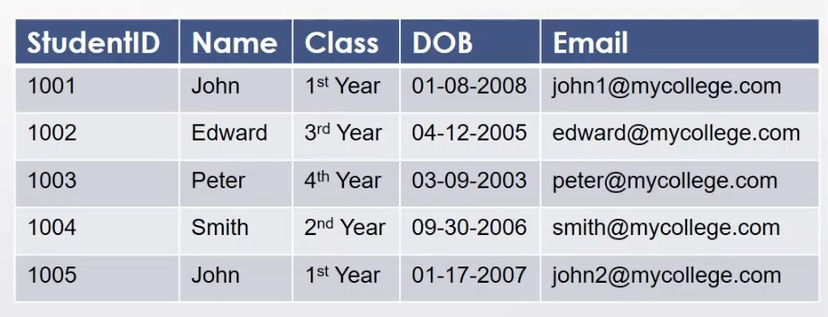
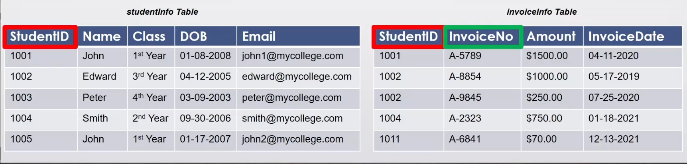

# MSSQL DBA

**Content:-**

[Basic](#1-database-fundamentals-and-design)


## 1. Database Fundamentals and Design

### Key



**Types of Keys:-**

**1. Candidate Key**
- It is an attribute or set of attributes that uniquely identifies a record.
- Table can have multiple candidate keys.
- Among the set of candidate, one candidate key is chosen as primary key.

*Both `StudentID` and `Email` are candidate keys, but `StudentID` was chosen as the Primary Key.*

**2. Primary Key**
- It is a set of one or more fields(columns) of a table that uniquely identify a record in database table.
- A table can have  only one primary key and one candidate key can select as a primary key.
- The primary key should be chosen such that its attributes are never or rarely changed.
- Cannot contain **NULL**
- Primary key field contain a clustered index.

*`StudentID` or `Email` can be a primary key.*

**3. Secondary Key / Alternate Key**
- Candidate keys that are not selected as primary key.
- Can also work as a primary key.

**4. Unique Key**
- A unique key is a set of one or more attribute that can be used to uniquely identify the records in table.
- Unique key is similar to primary key but unique key field can contain a **NULL** value but primary key doesn't allow **NULL** value.
- Unique field contain a non-clustered index.

**5. Composite Key**
- It is a combination of more than one attributes that can be used to uniquely identify each record.
- A composite key may be a candidate or primary key.

*if we combine StudentID and Email*

**6  Super Key**

Any combination of columns that can uniquely identify a row (includes more columns than necessary).

Examples in `studentInfo`:

- {StudentID} ✅
- {StudentID + Name} ✅
- {StudentID + Email + Class} ✅
- {Email} ✅

*A Super Key may contain redundant columns. Every Primary Key is a Super Key, but not vice versa.*

**7. Foreign Key**
- Foreign key is a field is database table that is primary key in another table.
- It is used to generate the relationship between the tables.
- It can accept null or duplicate value( e.x. in invoiceinfo table we have 1002 twice).

*`StudentID` in invoiceInfo is a Foreign Key referencing `StudentID` in studentInfo*



### Transaction
- A transaction is a sequence of one or more SQL operations (read/write) treated as a single logical unit of work. Either all operations succeed (commit) or all are rolled back (abort) — there's no partial state.
- The classic example: transferring ₹500 from Account A to Account B. Two operations must happen together — debit A and credit B. If one fails, neither should apply.

---

### Transaction States

| State | Meaning |
|-------|---------|
| **Active** | Transaction is being executed |
| **Partially Committed** | Last operation has executed; not yet saved |
| **Committed** | All changes permanently saved to DB |
| **Failed** | An error was detected; transaction cannot proceed |
| **Aborted** | Rolled back; DB restored to pre-transaction state |
| **Terminated** | Transaction is completely done (either committed or aborted) |

---

### State Transitions

- **Active → Partially Committed** — All SQL statements execute successfully
- **Active → Failed** — An error occurs during execution
- **Partially Committed → Committed** — Changes are written to disk (COMMIT)
- **Partially Committed → Failed** — I/O or system failure before commit
- **Failed → Aborted** — System performs ROLLBACK to undo all changes
- **Aborted → Active** — Transaction is restarted (optional)
- **Committed → Terminated** — Transaction completes successfully
- **Aborted → Terminated** — Transaction ends after rollback

---




**Now let's look at the transaction lifecycle using the bank transfer example:**



**ACID Properties :-**
- **Atomicity** — The entire transaction is treated as one unit. If the debit of Account A succeeds but the credit to Account B fails, the debit is also undone. No in-between state ever persists.
> Example: If debiting Account A succeeds but crediting Account B fails, the debit is also undone.

- **Consistency** — The database must move from one valid state to another. Before the transfer, A+B = ₹1200. After the transfer, A+B must still = ₹1200. No money is created or lost.
> Example: Before transfer, A + B = ₹1200. After transfer, A + B must still = ₹1200.

- **Isolation** — If two transactions run simultaneously (T1 transferring money, T2 checking balance), they should not interfere with each other. T2 should see either the state before T1 or after T1 — never a half-done state.
> Example: T2 checking a balance should see either the state before T1 or after T1 — never a half-done state.

- **Durability** — Once a transaction is committed, the data is permanently saved even if the system crashes immediately afterward (achieved via write-ahead logs).
> Example: After a successful bank transfer is committed, a system crash will not lose the updated balances.

## Example: Bank Transfer (₹500 from A to B)

### Successful Transaction (Commit)
```sql
BEGIN TRANSACTION;
  UPDATE accounts SET balance = balance - 500 WHERE id = 'A';  -- Debit A
  UPDATE accounts SET balance = balance + 500 WHERE id = 'B';  -- Credit B
COMMIT;
```
**Result:** A = ₹500 | B = ₹700 | Total = ₹1200 ✓

### Failed Transaction (Rollback)
```sql
BEGIN TRANSACTION;
  UPDATE accounts SET balance = balance - 500 WHERE id = 'A';  -- Debit A
  -- Network error! Credit to B fails
ROLLBACK;
```
**Result:** A = ₹1000 | B = ₹200 | Restored to original ✓

---


## Normization
Normalization is the process of organizing a database to reduce data redundancy and improve data integrity by dividing large tables into smaller, related tables.



**Unnormalized Form (UNF)** — The Problem Table
The raw table has repeating groups (multiple subjects in one cell):

| StudentID | Name | Subjects | Teacher | City |
|-----------|------|----------|---------|------|
| 1001 | Chandan | Math, Science | Mr. A, Mr. B | Delhi |
| 1002 | Saloni | English | Ms. C | Mumbai |

**Problems:** Multiple values in one cell, can't query individual subjects easily.

--------



After 1NF, the table has atomic values but a new problem appears — `Name` and `City` depend only on `StudentID`, not on the full composite key `(StudentID + Subject)`. This is a partial dependency, which 2NF eliminates.

---



After 2NF, the `Student` table is clean. But in `StudentSubject`, `Teacher` depends only on `Subject` — not on the full key. This is a transitive dependency (non-key column depending on another non-key column), which 3NF eliminates.

---



After 3NF, each piece of information lives in exactly one place, so all three anomalies disappear.

---

**BCNF (Boyce-Codd Normal Form) — a stricter version of 3NF.**


**Now let's see the actual decomposition into BCNF tables:**



**BCNF Explained**
The key difference from 3NF — a table can satisfy 3NF but still violate BCNF. This happens when there are multiple overlapping candidate keys.
In the example above:

- The table has two candidate keys: `{StudentID, Subject}` and `{StudentID, Teacher}`
- `Teacher` → Subject exists (one teacher teaches only one subject)
- `Teacher` is not a super key — so BCNF is violated
- Yet the table passes 3NF because `Subject` is part of a candidate key

BCNF says: for every dependency X → Y, X must be a super key — no exceptions, no loopholes.

Complete Normalization Hierarchy:-

| Form | Condition | Fixes |
|------|-----------|-------|
| 1NF | Atomic values, no repeating groups | Multi-valued cells |
| 2NF | 1NF + no partial dependency | Redundancy from partial keys |
| 3NF | 2NF + no transitive dependency | Non-key depending on non-key |
| BCNF | Every determinant must be a super key | Anomalies 3NF misses (overlapping candidate keys) |

>Every BCNF table is in 3NF, but not every 3NF table is in BCNF. BCNF is strictly stronger.


---
## BACKUP AND RESTORE
**TYPES of Backups: -**
1. **Full Backup:** a complete, page-be-page copy of an entire database including all the data. All the structures and all other objects stored within the database.

2. **Differential backups:** a backup of a database that has modified in any way since the last full backup.

3. **Transaction log A backup:** of all the committed transactions currently stored in the transaction log.

4. **Copy-only backup:** a special use backup that is independent of the regular sequence of SQL server backups.

5. **File backup:** a backup of one or more database files or filegroups.

6. **Partial backup:** contains data from only some of the filegroups in a database.

**CREATE TEST DATABASE:-**
```
use master
go
```
```
create database backupDB 
go
```
```
use backupDB
go
```
**CREATE TABLE**
```sql
create table Products (ProductID int IDENTITY (1,1) Primary Key, Productflame varchar (100), Brand varchar (100)) 
go
```
**INSERT SOME RECORDS**
```sql
INSERT INTO Products (Productflame, Brand) VALUES ('iPhone 15', 'Apple');
INSERT INTO Products (Productflame, Brand) VALUES ('Galaxy S24', 'Samsung');
INSERT INTO Products (Productflame, Brand) VALUES ('Xperia 1 V', 'Sony');
INSERT INTO Products (Productflame, Brand) VALUES ('Pixel 8', 'Google');
INSERT INTO Products (Productflame, Brand) VALUES ('ThinkPad X1 Carbon', 'Lenovo');
```
View the TABLE to verify the data
```sql
SELECT * FROM Product;
```
### 1. FULL BACKUP USING T-SQL
```sql
BACKUP DATABASE [<DB_NAME>] TO DISK N'd:\fullbackups\dbbackup.bak'
WITH NOINIT, NAME NDB NAME>-Full Database Backup", COMPRESSION STATS 10
go
-- NOINIT: not be overwitten, STATS 10: updated every 10sec
```

**STEP FOR FULL BACKUP GUI:-**
- right click on database ->Tasks->Backup
- Destination: choose location remove and add new location if required followed by file name with .bak extension.
>NOTE: Take backup in off hours because it consume high CPU.
- To see the backup go to the location where you saved it.
>NOTE: after full backup if some entries added or replace and at that time do crash then the changes will not get recovered.

### 2. TRANSACTIONAL LOG BACKUP
To take tran. log backup 1st we must have recovery model is in FULL mode and 2nd full database backup had been executed.
**TO check recovery mode in all the databases:-**
```sql
SELECT name, recovery model desc
FROM sys.databases
ORDER BY name
```
Insert data into table AFTER a full backup, but before a transactional log backup. so it will log the new entry

**Transactional BACKUP USING T-SQL:-**
```sql
BACKUP LOG [<DB_NAME>]
TO DISK N'd:\fullbackups\dbbackup.bak' WITH NOINIT,
NAMEN<DB NAME>-Transactional Log Backup', COMPRESSION
STATS-10
go
```
> NOTE: the same bkp file will have the full backup and transactional log backup.

To see the details:-
```sql
RESTORE HEADERONLY FROM DISK N'd:\fullbackup\dbbackup.bak
```
You will see 2 row one is FULL backup and other is Transaction log backup.

> NOTE: FULL backup type is 1, differential backup type is 5 and trans. log backup type is 2.

### 3. DIFFERENTIAL BACKUP
So inserting data is continuing and if this happens all day and if we take transactional log backup every 15mins than at the end we may have more then 100 transactional log backup to accommodate those change made. 50, differential backup only record the changes since the last database FULL backup and it great for the restore.

**SCRIPT**
```sql
BACKUP DATABASE [<DB_NAME>]
TO DISK N'd: \fullbackups\dbbackup.bak" WITH DIFFERENTIAL, NOINIT, NAME N'DB_NAME>-Transactional Log Backup'
COMPRESSION
STATS 10
go
```
>NOTE: Differential are cumulative in nature and they can get large in size so monitor it. IT is use in LARGE databases.

## RESTORE

Delete the database right click and delete.

right click on Databases-> restore database-> device and add backup path-> select the file and click ok-> you will see all the backups taken like Full, transactional log backup and differential backup.-->Click ok it will restore it.

**TYPES:-**

1. With Recovery

2. With No Recovery

3. Standby Mode