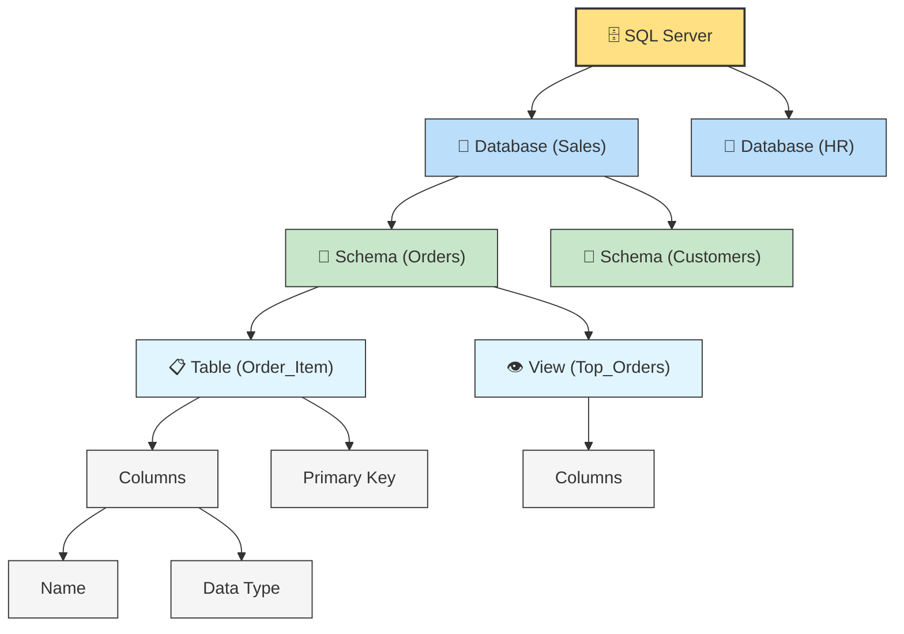
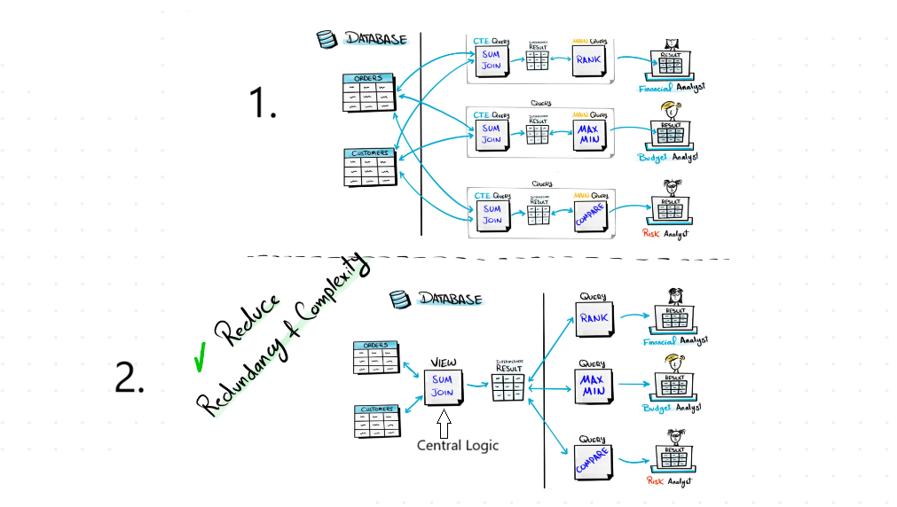
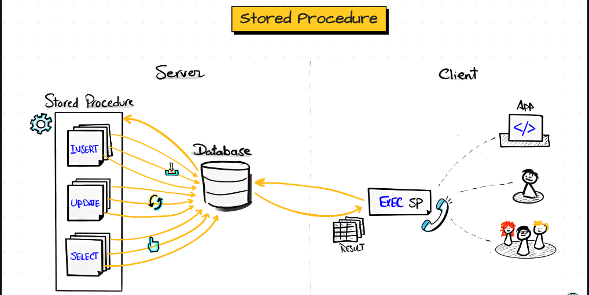

# VIEW
It is a virtual table that shows data without storing it physically. In order to see the data, we have to execute the query behind the view.

### Database Structure


### How we get the output from Table?
The sql query trigger the queue that is attached to the view and the query is responsible to query the physical table and then the result is going to fill the structure of the view and we get back the result.

We are directly querying the view but actually we indirectly querying a physical table.


### Difference
| VIEW | TABLE |
|--|--|
| No Persistance | Persisted Data |
| Easy to Maintain | Hard to maintain |
| Slow Response | Fast Response |
| Read | Read/Write |
### Why to use Views?


In 1st all the Analyst using the same CTE query to get the result. so it is complete redundecy and make no sense.

so, 2nd we can do the first step as view in database insist of using CTE `SUM JOIN` each time we're going to take this script and put it in the database. So, the analyst, instead of going directly to the physical tables they can goto the view.

### Difference View & CTE

| VIEWS | CTE |
|--|--|
| Reduce redundancy in multi-queries | Reduce Redundancy in single query |
| Improve reusability in multi-queries | Improve reusability in single query |
| Persisted Logic | Temporary logic |
| Need to maintain - Create/Drop| no maintenance - auto cleanup |

```sql
-- (https://github.com/DataWithBaraa/sql-ultimate-course/blob/main/datasets/sql-server/init-sqlserver-salesdb.sql)
-- To Find the running Total of Sales for each month.
-- Without View using CTE
WITH CTE_Monthly_Summary AS (
	SELECT 
	DATETRUNC(month, OrderDate) OrderMonth,
	SUM(Sales) TotalSales,
	COUNT(OrderID) TotalOrders,
	SUM(Quantity) TotalQuantities
	FROM Sales.Orders
	GROUP BY DATETRUNC(month, OrderDate)
)
SELECT OrderMonth, TotalSales, SUM(TotalSales) OVER (ORDER BY OrderMonth) AS RunningTotal
FROM CTE_Monthly_Summary;

-- Using View : if a table or view is created without specifying a schema, it defaults to the DBO.
CREATE VIEW V_Monthly_Summary AS
(
	SELECT 
	DATETRUNC(month, OrderDate) OrderMonth,
	SUM(Sales) TotalSales,
	COUNT(OrderId) TotalOrders,
	SUM(Quantity) TotalQuantities
	FROM Sales.Orders
	GROUP BY DATETRUNC(month, OrderDate)
)

-- Insist of Query the above we will query the below view.
SELECT * from V_Monthly_Summary;

SELECT OrderMonth, TotalSales, SUM(TotalSales) OVER (ORDER BY OrderMonth) AS RunningTotal
FROM V_Monthly_Summary;

-- Creating View as Sales Schema
CREATE VIEW Sales.V_Monthly_Summary AS
(
-- ...
)

-- DROP VIEW
DROP VIEW Sales.V_Monthly_Summary;

-- TO modify the existing View in SQL Server we must drop it and recreate is with the change we need.
-- In Postgres we just add `CREATE OR REPLACE VIEW ..`
-- OR using T-SQL we can replace it. see below example.
IF OBJECT_ID('V_Monthly_Summary', 'V') IS NOT NULL
	DROP VIEW V_Monthly_Summary;
GO
CREATE VIEW V_Monthly_Summary AS
(
	SELECT 
	DATETRUNC(month, OrderDate) OrderMonth,
	SUM(Sales) TotalSales,
	COUNT(OrderId) TotalOrders
	FROM Sales.Orders
	GROUP BY DATETRUNC(month, OrderDate)
)
```

# STORE PROCEDURE
A **Stored Procedure** in SQL is a **precompiled collection of one or more SQL statements** that is stored in the database and can be executed whenever needed.

We have to perform , 1. `INSERT`, 2. `UPDATE`, 3.`SELECT`  query which is keep repeating to get the data everyday which is bit time confusing and we might cause human error. So, that's why we have STORE PROCEDURES in SQL. 
So, we put all those sql statements in one program called STORE PROCEDURE. And this store proc. will store in server side of the database. so, inorder to interact with sql statement we got to execute the store procedure.
When we call exec SP inside the server it will start executing all the sql statements that we have inside the stored procedure and it will return back to the user.
> We can store multiple SQL statements in specific order and we can save in inside the database and each time we need ours sql statement we can go and simply execute them.




### Syntax
```sql
CREATE PROCEDURE ProcedureName AS
BEGIN 
-- Stored Procedure Definition
END

-- Execution (Call)
EXEC ProcedureName

-- TO DROP
DROP PROCEDURE <ProcedureName>
```
### Example
```sql
-- Find the total numbers of Customers and Average Score of US customers.
-- 1. 
SELECT COUNT(*) TotalCustomers,
AVG(Score) AvgScore
FROM Sales.Customers
WHERE Country = 'USA'

-- 2. Turning the query into a Stored Procedure
CREATE PROCEDURE GetCustomerSummary AS
BEGIN
	SELECT COUNT(*) TotalCustomers,
	AVG(Score) AvgScore
	FROM Sales.Customers
	WHERE Country = 'USA'
END -- to see under DB click on Programmability

-- To Run the above Store procedure
EXEC GetCustomerSummary 
```

### Stored Procedure with Parameters
As in the above query insist of USA we can add India. so in this we are changing the static values with a parameter. and while executing the stored proc. we can decide with country we want to execute.
```sql
CREATE PROCEDURE GetCustomerSummaryWithPara @Country NVARCHAR(50)
AS
BEGIN
	SELECT COUNT(*) TotalCustomers,
	AVG(Score) AvgScore
	FROM Sales.Customers
	WHERE Country = @Country 
END

EXEC GetCustomerSummaryWithPara @Country = 'Germany'
EXEC GetCustomerSummaryWithPara @Country = 'USA'
```
